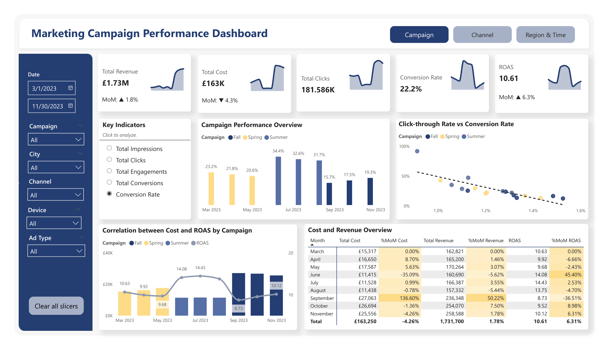
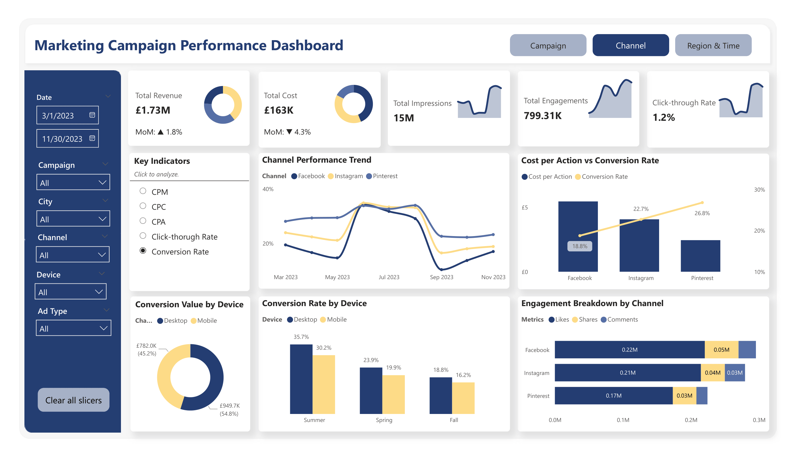
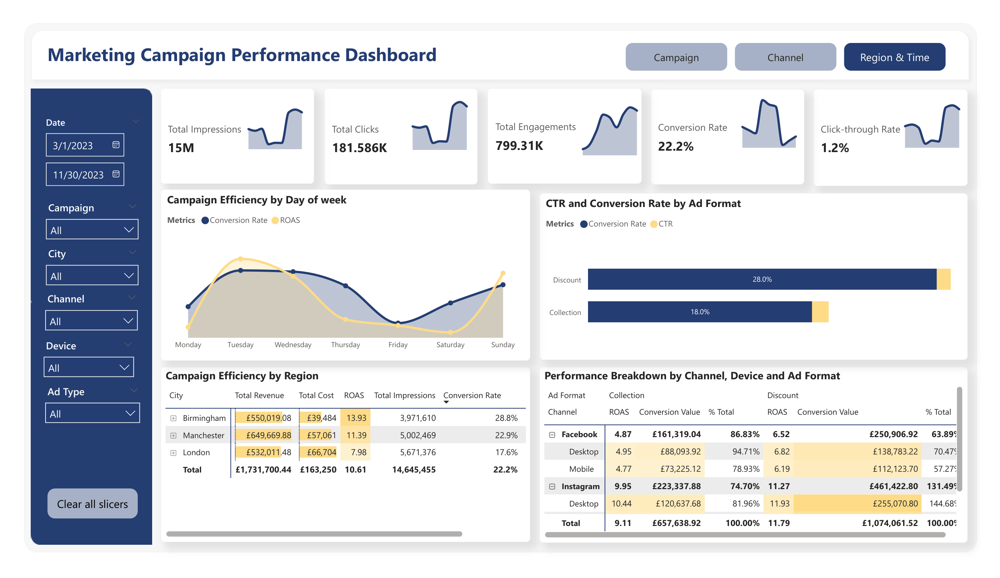
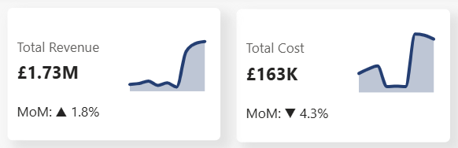
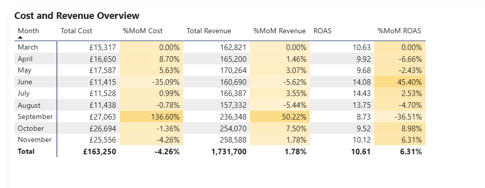
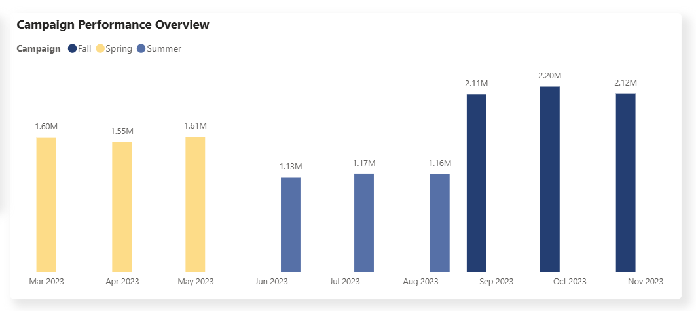
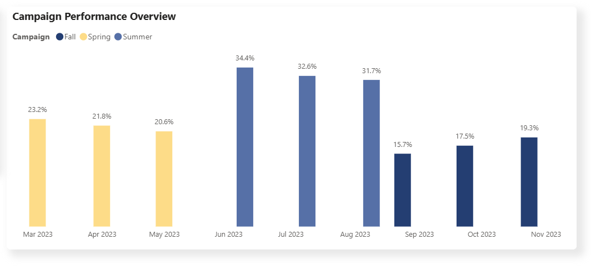
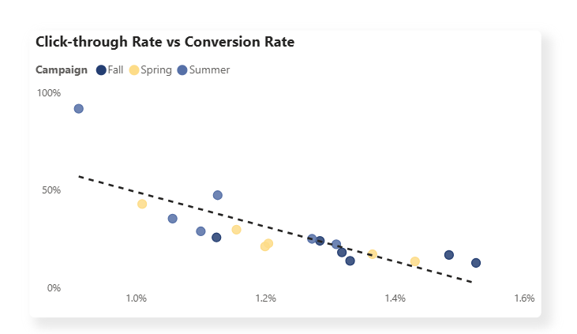

## 📂 Project Background

Sterling & Co. is a sample UK-based retail business specializing in clothing and accessories. In 2023, the company executed a seasonal marketing campaign utilizing two primary ad formats (Collection Ads and Discount Ads) across three social media channels in the UK: Facebook, Instagram, and Pinterest.

Reporting to the Head of Marketing, this in-depth analysis evaluates Sterling & Co.’s overall marketing performance. The key insights and recommendations focus on the following areas:

### Northstar Metrics

- **Overall Campaign Performance** – Evaluating campaign costs and generated revenue across different seasons to optimize budget allocation for future campaigns.
- **Channel Performance** – Analyzing performance across channels to identify those that deliver the strongest results and demonstrate the highest consumer engagement.
- **Regional Performance** – Assessing campaign effectiveness across cities and ad formats to enhance targeting strategies and improve return on investment.

## 🔗 Data Structure & ERD (Entity Relationship Diagram)

The company’s main database structure, as seen below, consists of seven tables: dim_ad, dim_campaign, dim_calendar, dim_channel, dim_device, dim_region, fact_mkt, with a total row count of 9,900 records. A description of each table is as follows:

- `dim_ad`: Ad format types – Collection Ads (product showcase) and Discount Ads (sales and promotional offers).
- `dim_campaign`: Campaign categories categorized by season.
- `dim_calendar`: Date dimension.
- `dim_channel`: Social media channels (Facebook, Instagram, Pinterest).
- `dim_device`: Device types used by users (Desktop or Mobile).
- `dim_region`: Cities where advertisements were distributed.
- `fact_mkt`: Campaign performance metrics, including engagement and revenue.
  

## 📝 Executive Summary

### Overview of Findings

**1. Inefficient Budget Allocation**: The average conversion rate (CR) and return on ad spend (ROAS) were high, accounting for 22.2% and 10.61, respectively. However, budget distribution across seasonal campaigns is not optimized. The Summer campaign was allocated a lower budget than other seasons but delivered higher efficiency, indicating a misalignment between spending and performance.

**2. Channel Performance Differences**: Although the click-through rate (CTR) is high, the conversion rate remains low, suggesting inefficiency in converting traffic into purchases. 

**3. Ad Format Effectiveness**: Discount Ads outperform Collection Ads in terms of conversion rate. Despite having similar click-through rates, Discount Ads achieve higher conversion, indicating stronger purchase incentives. 

**4. Regional Performance**: Birmingham records the highest Conversion Rate and ROAS. This region demonstrates the strongest performance among all cities.

<table style="width: 100%;">
  <tr>
    <td style="width: 33.33%; text-align: center;">
      
      
<i>Campaign</i>

    </td>
    <td style="width: 33.33%; text-align: center;">
      
      
<i>Channel & Device</i>

    </td>
    <td style="width: 33.33%; text-align: center;">
      
      
<i>Region & Time</i>

    </td>
  </tr>
</table>

## 👀 Insights Deep Dive
### Campaign

**1. Cost and Revenue**
- Overall, the company spent a total of £163.3K on the campaign, with an average month-over-month (MoM) decrease of 4.3%. The greatest cost drop was from the Spring campaign to the Summer campaign (35%). In contrast, the budget was expanded by 1.3 times at the end of the Summer campaign, rising from £11K in August to £27K in September.
- The campaign generated £1.73 million in revenue, with a MoM increase of 1.8%. The most significant rise was from August (£157K) to September (£236K), indicating an increase in conversion thanks to the increased expenditure.
- However, regarding the return on ad spend (ROAS), a 45% rise was witnessed from May to June, while there was a 37% decrease from August to September. This suggests that although the number of buyers rose, the budget was not well distributed and there was a waste of money.

<table border="0" style="width: 100%;">
  <tr>
    <td align="center">
      
    </td>
    <td align="center">
      
    </td>
  </tr>
</table>
      
**2. Ad Performance** 
- Based on impressions and clicks, the Fall campaign performed the strongest, followed by Spring and then Summer. This trend aligns with how the budget was allocated across campaigns, with higher spend driving higher visibility and engagement.
- However, when looking at conversion rates, the Summer period performed best, with an average conversion rate of 32.9%. This is nearly double that of Fall, which recorded only 17.5%, indicating that higher spending did not translate into proportional conversions and suggests cost inefficiency during the Fall campaign.

<table border="0" style="width: 100%;">
  <tr>
    <td align="center">
      
      
<i>Total Impressions by Month</i>

    </td>
    <td align="center">
      
      
<i>Conversion Rate by Month</i>

  </tr>
</table>

- There is a negative relationship between click-through rate and conversion rate. While users show interest by clicking on the ads, this interest does not consistently lead to conversions. This suggests that the messaging or call to action may not be strong or clear enough, indicating a need to refine ad content and format.

### Channel & Device

**1. Channel**
- Overall, CTR and conversion rate increased in line with higher budget allocation, though efficiency varied by channel.
- Pinterest is the most cost-efficient platform, delivering the lowest CPM (£6.47), CPC (£0.66), and CPA (£2.45), alongside the highest conversion rate (26.8%). This indicates strong purchase intent and effective audience alignment.
- Facebook underperforms relative to spend, with the highest CPM (£13.17) and CPA (£5.45), and the lowest conversion rate (18.8%). This suggests inefficiencies in targeting or creative strategy and warrants optimisation.
- Instagram generates the highest total conversion value (£684), despite moderate costs. This likely reflects higher average order value or stronger monetisation per conversion, making it a key channel to sustain and potentially scale for revenue growth.
      
2. **Device**
- Desktop consistently achieved a 2–5% higher conversion rate than mobile across all three seasonal campaigns.
- Total conversion value is relatively similar by device; however, desktop generated higher revenue (£949.7K) than mobile (£782K). This indicates stronger transaction performance on desktop, suggesting priority allocation toward desktop while optimising the mobile journey.
- The performance gap may be driven by mobile-specific friction points (e.g., landing page usability or payment issues), which require further analysis before structural budget changes.
      
[Visualization specific to category 2]

### Region & Time

**1. Region and Ad format**
  - London requires the highest spend (£532,011) with low proportional returns, only 7.98 in ROAS.  Meanwhile, Manchester generates the highest revenue, approximately £100K more than Birmingham. This city operates at the lowest cost (£39,484) while delivering the highest ROAS and conversion rate, indicating strong efficiency despite the money spent.
  - When comparing click-through rate and conversion rate across the two ad formats, both achieved a similar CTR of around 1%. However, the Discount format delivered a significantly higher conversion rate (28%) compared to the Collection format (18%). This indicates that while users are equally interested in both formats, they are more likely to convert when a discount is offered.
  - The Instagram – Desktop – Discount format combination shows the strongest performance, generating the highest conversion value at £255,071, indicating strong potential for further investment.
    
**2. Time**
   
Conversion rates are highest during the first half of the week (Mon - Thur), at about 22%. However, ROAS does not follow the same pattern, as it peaks on Tuesday (10.87) and then declines before rising again on Sunday (10.78). This suggests that the variation is likely driven by differences in average order value rather than advertising performance only. Therefore, high-value products should be prioritized for retargeting on days with higher conversion rates throughout the week.

[Visualization specific to category 3]

## ✨ Recommendations:

Based on the insights and findings above, we would recommend the Marketing team to consider the following:

**1. Campaign**
- Conduct a deeper analysis to identify why the Summer campaign achieved the highest conversion rate despite having the lowest budget (e.g., audience targeting, ad creatives, campaign timing, or ad formats).
- Replicate the successful elements of the Summer campaign in Spring and Fall campaigns to reduce the efficiency gap across seasonal campaigns.
- Adjust budget allocation based on performance metrics such as conversion rate and ROAS, rather than impressions or traffic alone.
- Avoid sudden budget increases (e.g., the sharp rise from August to September) and instead apply gradual budget scaling to maintain campaign efficiency.
      
**2. Channel**
- Increase investment in Pinterest, as it delivers the lowest CPM, CPC, and CPA while achieving the highest conversion rate, indicating strong audience alignment.
- Expand Pinterest targeting strategies by testing new audience segments or lookalike audiences based on existing converters.
- Improve the performance of Facebook campaigns by reviewing audience targeting, testing alternative creatives, and refining ad messaging or calls to action.
- Maintain investment in Instagram, as it generates the highest conversion value despite moderate costs.
- Gradually scale Instagram campaigns, particularly using high-performing formats such as discount advertisements.
    
**3. Region**
- Optimize advertising efficiency in London by refining audience targeting and testing localized creatives.
- Gradually increase budget allocation in Birmingham, as it demonstrates strong ROAS and conversion efficiency despite lower spending.
- Allocating more resources to high-performing regions while optimizing targeting in lower-performing markets.
